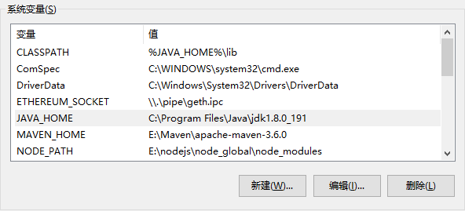

Windows系统下
---  
#### 1、下载JDK 
Oracle 官网JDK 8u191 [下载链接](https://www.oracle.com/technetwork/java/javase/downloads/jdk8-downloads-2133151.html)  
> 奇数版与偶数版的区别：  
　　从JDK版本7u71以后，JAVA将会在同一时间发布两个版本的JDK，其中：奇数版本为BUG修正并全部通过检验的版本，官方强烈推荐使用这个版本。偶数版本包含了奇数版本所有的内容，以及未被验证的BUG修复，Oracle官方表示：除非你深受BUG困扰，否则不推荐您使用这个版本。[详情](https://www.oracle.com/technetwork/java/javase/cpu-psu-explained-2331472.html)  
  
 DOS命令界面输入以下命令
 
    java -version 
确定JDK安装成功

#### 2、配置环境变量
对于Java程序开发而言，主要会使用JDK的两个命令：javac.exe、java.exe。  
路径：`C:\Program Files (x86)\Java\jdk1.8.0_191\bin`。但是这些命令由于不属于windows自己的命令，所以要想使用，就需要进行路径配置。  
新建系统变量`JAVA_HOME`值 `C:\Program Files (x86)\Java\jdk1.8.0_191`,系统变量`PATH`后面加上`%JAVA_HOME%\bin`。
如图： 

#### 3、确认环境配置是否正确
控制台分别输入java，javac，java -version 命令

    java
    javac
    java -version
