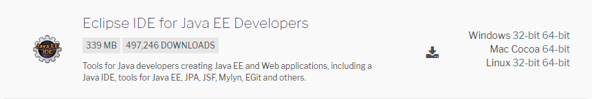
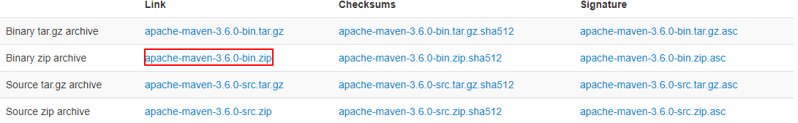
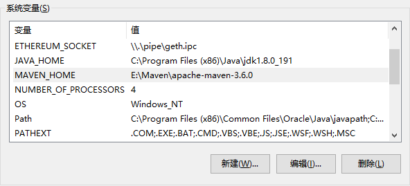

Windows操作系统
---
#### 1、Eclipse官网下载
下载链接:[https://www.eclipse.org/downloads/packages/](https://www.eclipse.org/downloads/packages/) 
根据电脑系统下载相应的安装包

#### 2、Maven下载及配置
1. 下载链接:[https://maven.apache.org/download.cgi](https://maven.apache.org/download.cgi)  

2. 解压apache-maven-3.6.0-bin.zip，并把解压后的文件夹下的apache-maven-3.6.0文件夹移动到E:\Maven(自定义) 下，如果没有Maven 这个文件夹的话，请自行创建。  
3. 新建系统变量`MAVEN_HOME`变量值:E:\Maven\apache-maven-3.6.0,编辑系统变量`Path`添加变量值:%MAVEN_HOME%\bin  
如图: 

